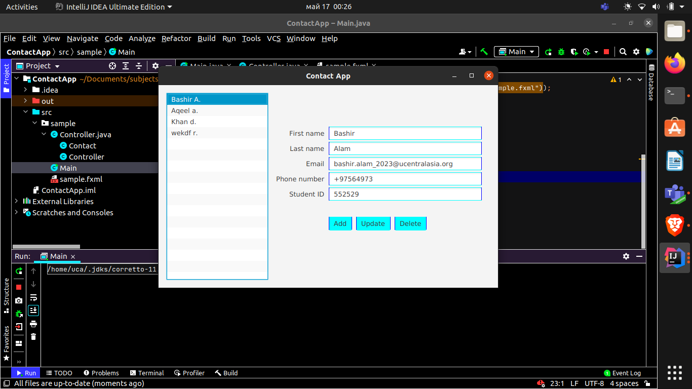

<h1> Contact App</h1>

(Contacts App) Create a Contacts app modeled after the Cover Viewer app (Sections 13.5 –13.6). Store the contact information in an ObservableList of Contact objects. A Contact should contain first name, last name, email and phone number properties (you can provide others). When the user selects a contact from the contacts list, its information should display in a Grid of TextFields. As the information is modified (a Contact’s data is updated, a new Contact is added or an existing Contact is deleted), the contacts ListView should display the updates. The ListView should display the Contact’s last names.

<h2>Software</h2>

Javafx

Scene builder

Java

<h2>Screenshots</h2>

#

