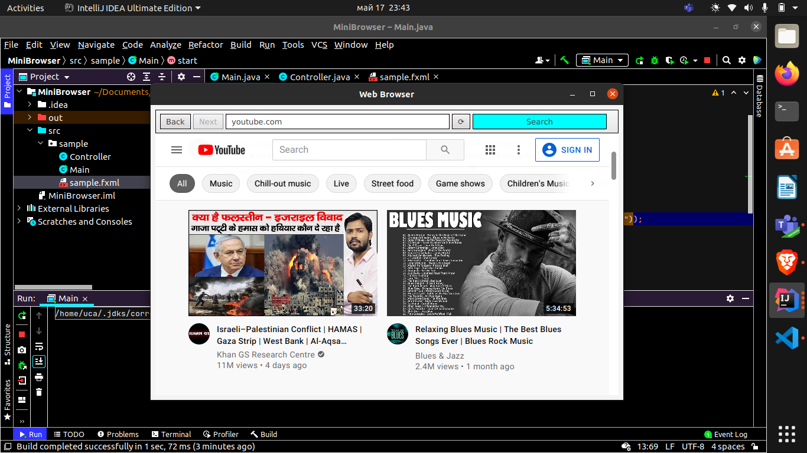
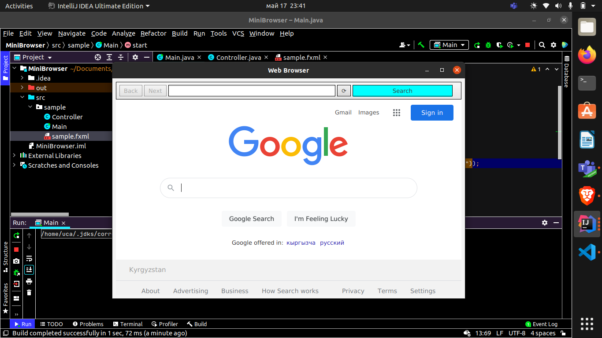

<h2> Mini Web Project </h2> 

<h3> Description </h3>
 Investigate the capabilities of JavaFX’s WebView control and WebEngine class, then create a JavaFX app that provides basic web browsing capabilities.

<h3> Software </h3>
<h4>JavaFX SDK 11.0.2  
Scene Builder 11.0.0   
IntelliJ IDEA   

<h3> App Screenshots </h3>

#

